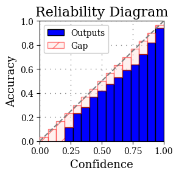
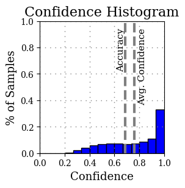

# Calibration Library

## Jonathan Pearce, McGill University

A model calibration library currently under construction. Built for PyTorch models, this library enables users to evaluate their model's uncertainty estimates (probability estimates) using popular calibration metrics, train model wrappers that improve model calibration and generate data visualizations to identify where and how their model's are well calibrated or not.

## References

### Metrics

ECE and MCE - [Obtaining Well Calibrated Probabilities Using Bayesian Binning](http://people.cs.pitt.edu/~milos/research/AAAI_Calibration.pdf)

SCE, ACE and TACE - [Measuring Calibration in Deep Learning](https://arxiv.org/abs/1904.01685)

### Recalibration Methods

Tempurature Scaling - [On Calibration of Modern Neural Networks](https://arxiv.org/abs/1706.04599)

### Visualizations

Reliability Diagram and Confidence Histograms - [On Calibration of Modern Neural Networks](https://arxiv.org/abs/1706.04599)
